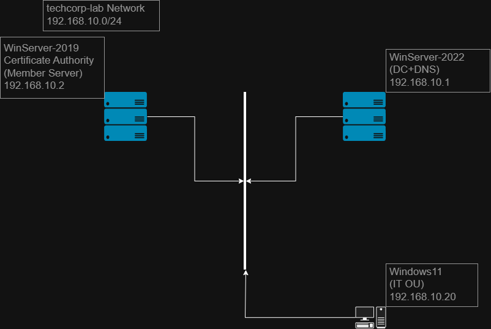
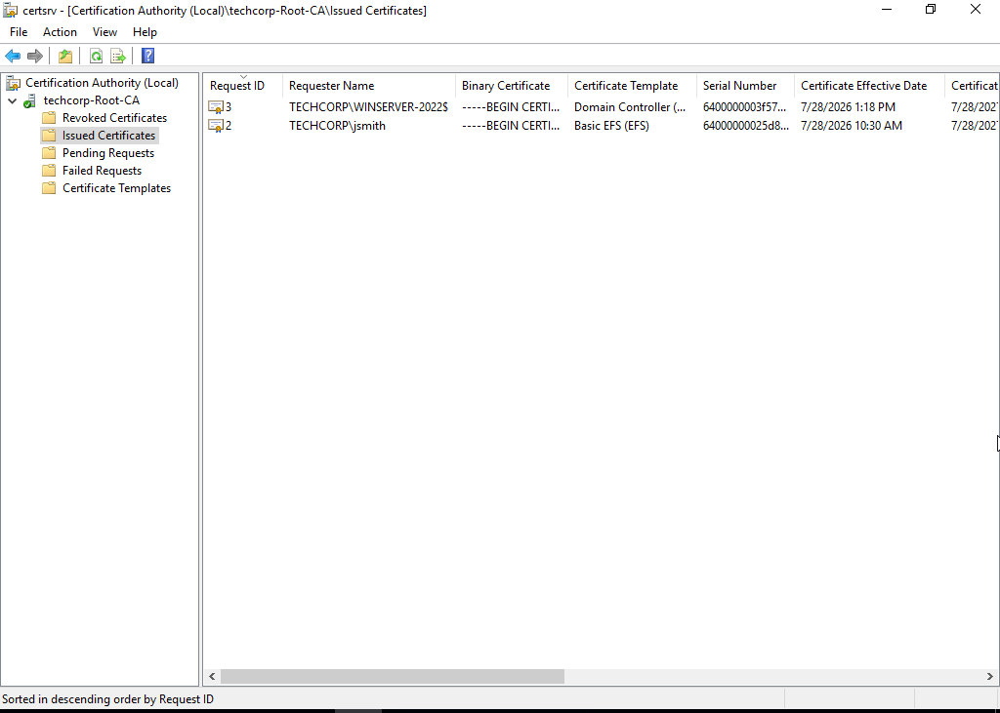
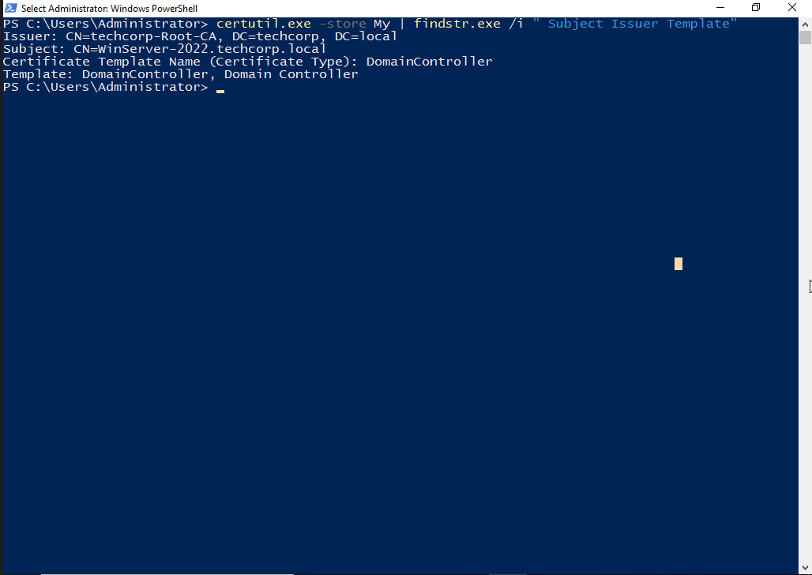
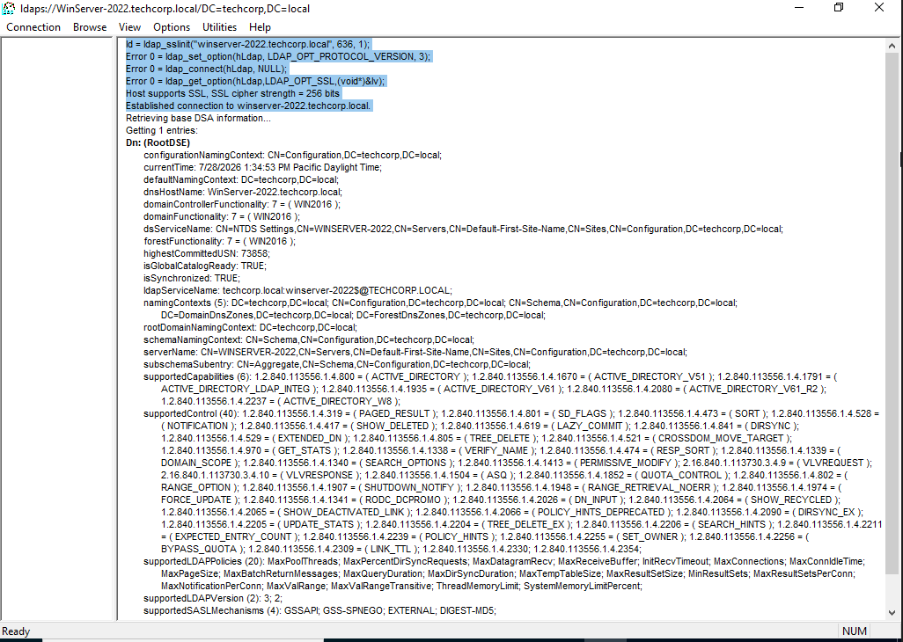
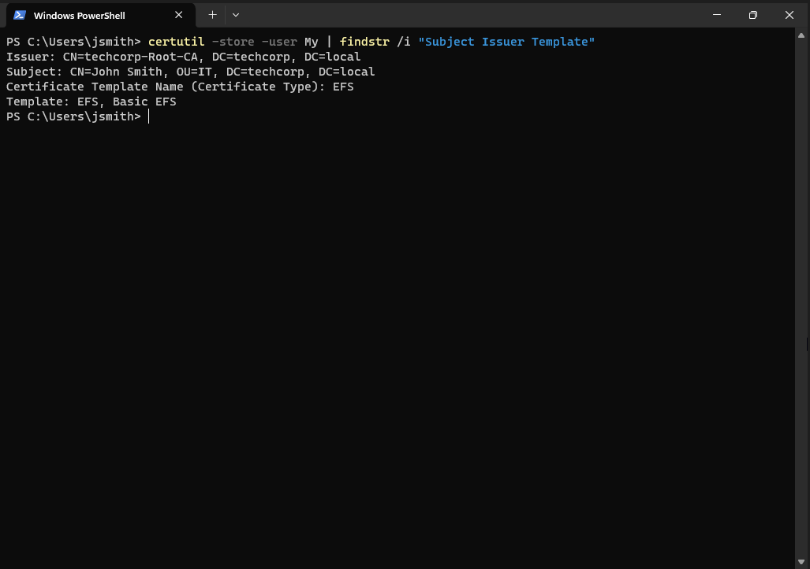
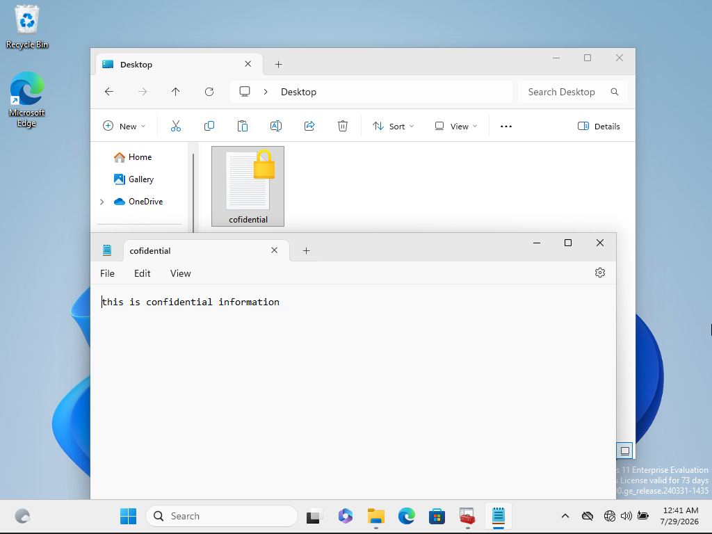
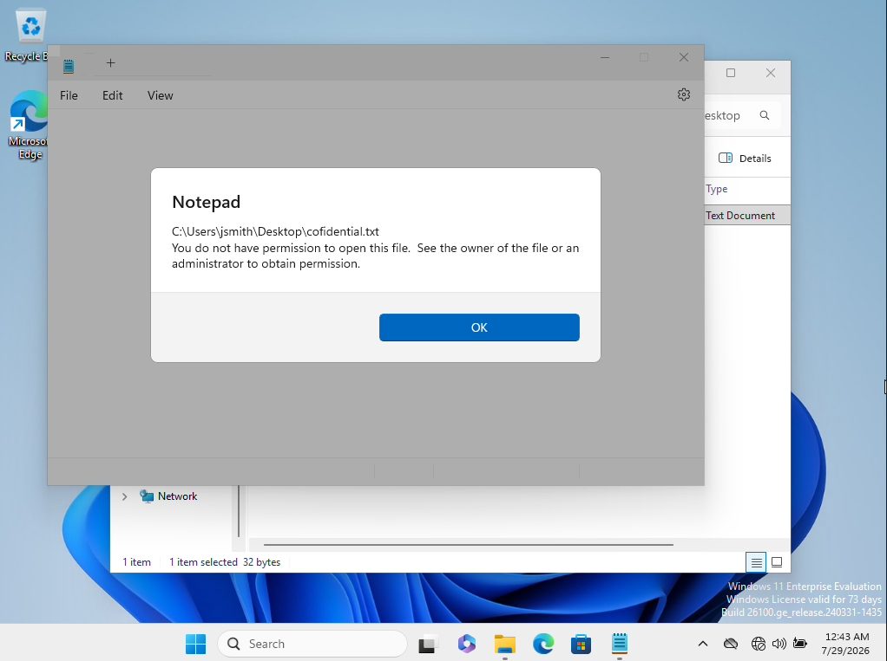

# TechCorp Active Directory Lab — AD Certificate Services (Internal PKI): LDAPS & EFS

A continuation of the `techcorp.local` Active Directory lab environment.
This phase builds an internal Public Key Infrastructure (PKI) using AD
Certificate Services (AD CS) and puts it to use in two real-world ways:
securing LDAP traffic to the Domain Controller (LDAPS) and encrypting a
file with EFS. The goal was to have one internal CA serve two genuinely
different, practical purposes rather than existing as a standalone,
unused component.

## Starting Environment

| Machine | Role | OS | IP |
|---|---|---|---|
| WinServer-2022 | Domain Controller (AD DS, DNS) | Windows Server 2022 | 192.168.10.1 |
| WinServer-2019 | Certificate Authority (Member Server) | Windows Server 2019 | 192.168.10.2 |
| Windows11 | IT Department workstation | Windows 11 | 192.168.10.20 |

- WinServer-2019 is deliberately **not** a Domain Controller. It is a
  domain-joined Member Server whose only role is hosting the CA.
- Existing user `jsmith`, a member of the `IT-Staff` security group, used
  for the EFS test.

## Why the CA Is Not on a Domain Controller

This was a deliberate architectural decision, not a default setup. A CA's
private key is what makes the entire PKI trustworthy — anyone who
compromises it can issue certificates that impersonate any user,
computer, or even another Domain Controller. Installing AD CS directly
on a DC would mean a single compromised machine exposes both:

- the domain's identity data (via `ntds.dit`), and
- the ability to mint trusted certificates for anything in the domain

Keeping the CA on a separate Member Server enforces **separation of
duties**: compromising the CA doesn't hand over the domain, and
compromising the DC doesn't hand over certificate-issuing power. This
mirrors real enterprise practice, where Root CAs are frequently kept
fully offline and issuing CAs are hosted independently of any DC.

## What Was Built

### 1. Enterprise Root CA
- AD CS (Certification Authority role service only) installed on
  WinServer-2019 and configured as an **Enterprise Root CA** named
  `TechCorp-Root-CA`
- Enterprise (not Standalone) was chosen specifically so the CA
  integrates with AD and supports GPO-driven auto-enrollment
- RSA 2048-bit key, SHA256 signature algorithm — the current practical
  standard; SHA1 is deprecated and no longer considered secure for
  signing

### 2. LDAPS (Securing LDAP Traffic to the DC)
By default, LDAP traffic to a Domain Controller (port 389) is
unencrypted — credentials and directory queries can be read in plain
text by anyone able to observe the network. LDAPS (port 636) wraps that
same traffic in TLS using a certificate issued to the DC itself.

- Enabled auto-enrollment via GPO (Computer Configuration → Windows
  Settings → Security Settings → Public Key Policies → Automatic
  Certificate Request Settings), targeting the built-in **Domain
  Controller** certificate template
- WinServer-2022 automatically requested and received a certificate from
  `TechCorp-Root-CA`

- Verified the certificate is actually usable for LDAPS — not just
  issued — by connecting to port 636 with `ldp.exe` and confirming a
  successful SSL handshake and a live RootDSE query over the encrypted
  channel

### 3. EFS (Encrypting a File)
EFS protects data at the file level rather than the whole disk — useful
when only specific files need protection, or when a stolen disk
shouldn't expose its contents to whoever has physical access to it.

- `jsmith` (IT-Staff) enrolled a **Basic EFS** certificate via
  `certmgr.msc` (Request New Certificate → Active Directory Enrollment
  Policy)
- Basic EFS was chosen deliberately over the more general **User**
  template: Basic EFS's Key Usage is restricted to Key Encipherment and
  its Application Policy is limited to Encrypting File System — nothing
  else. The User template additionally supports Digital Signature,
  Secure Email, and Client Authentication. Following the principle of
  least privilege, a certificate should only be capable of what it's
  actually needed for; a compromised all-purpose certificate is a larger
  attack surface than a narrowly-scoped one

- Encrypted a test file (`confidential.txt`) as `jsmith` — Windows marks
  EFS-protected files in File Explorer

- Verified enforcement: logged in as **Domain Admin** and attempted to
  open the same file. Access was denied

## Best Practices & Security Notes

- **Never install a CA role on a Domain Controller.** The CA holds the
  keys to trust for the entire PKI; a DC holds the keys to the entire
  domain. Combining them means compromising either one compromises both.
- **Enterprise CA vs. Standalone CA is a real choice, not a formality.**
  Enterprise CA integrates with AD for auto-enrollment and
  template-based issuance; Standalone CA requires manual request/approval
  and doesn't natively support GPO auto-enrollment. Enterprise is the
  right choice specifically because the goal was automated, low-friction
  certificate delivery to domain members.
- **A resultant certificate existing is not proof it's enforced.**
  Confirming a certificate was issued (via `certutil`) only proves
  enrollment succeeded. LDAPS and EFS were each verified with a live,
  functional test — an actual SSL handshake over port 636, and an actual
  access-denied result on an unauthorized account — rather than relying
  on the presence of the certificate alone.
- **Scope certificate templates to their actual purpose.** Basic EFS
  over the general User template is a small example of a broader rule:
  a certificate's Key Usage and Application Policies should match
  exactly what it needs to do, nothing more, so a compromised
  certificate has the smallest possible blast radius.
- **Even Domain Admin cannot bypass EFS by default.** EFS protection is
  tied to the file's encryption key, not to Windows account privilege
  level — an administrator without the original user's private key (or
  a configured Data Recovery Agent) cannot read the file's contents.
  This is by design, not a limitation: recovering EFS-protected files
  without the owner's key requires deliberately provisioning a Data
  Recovery Agent in advance, which was intentionally out of scope for
  this scenario.
- **SHA256 vs. the SHA1 thumbprint shown by certutil.** Tools like
  `certutil -store` display a `Cert Hash (sha1)` value — this is just a
  fixed-length identifier (thumbprint) for referencing the certificate
  quickly, unrelated to the actual signing algorithm used on the
  certificate itself, which was configured as SHA256.

## Key Takeaways

- Separating the CA from any Domain Controller is a foundational PKI
  security decision, not an optional refinement — it directly limits
  the blast radius of a single compromised machine.
- LDAPS and EFS are two different practical payoffs from the same
  internal PKI investment: one secures directory traffic in transit,
  the other secures file contents at rest.
- Verifying a certificate was issued and verifying it is actually
  enforced are two distinct checks — both were performed independently
  here rather than assuming one implies the other.
- This is a snapshot of the current state of the lab and reflects the
  decisions and trade-offs made at this stage — not a finished or final
  configuration.