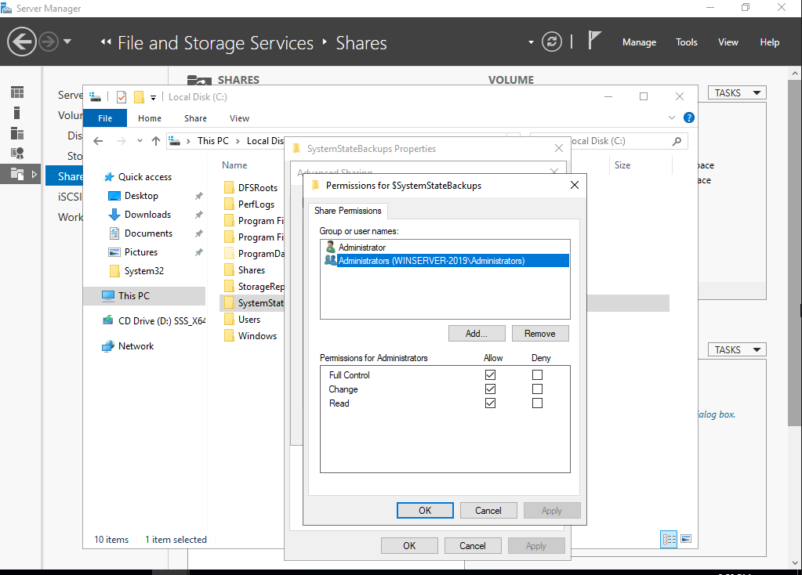
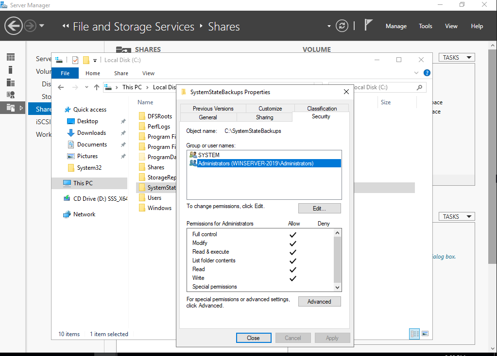
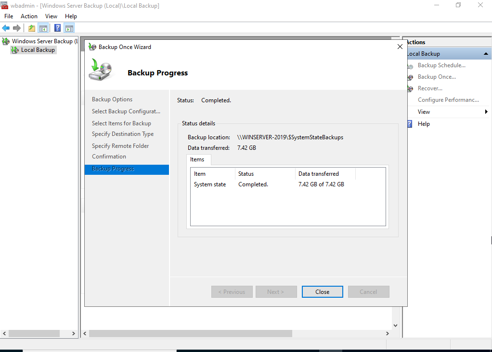
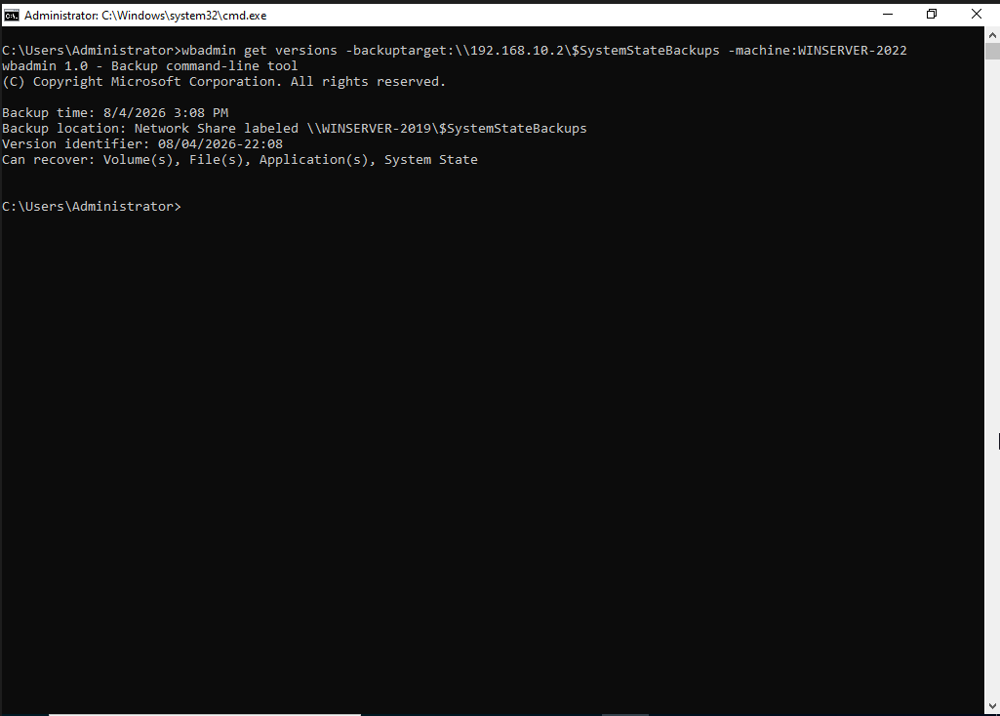
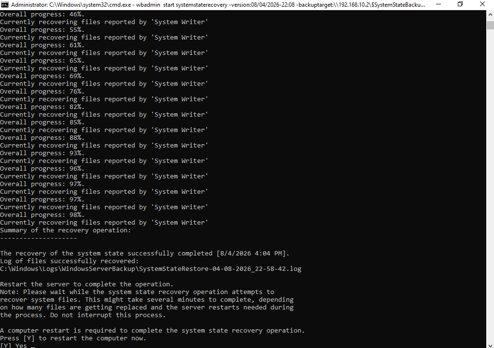
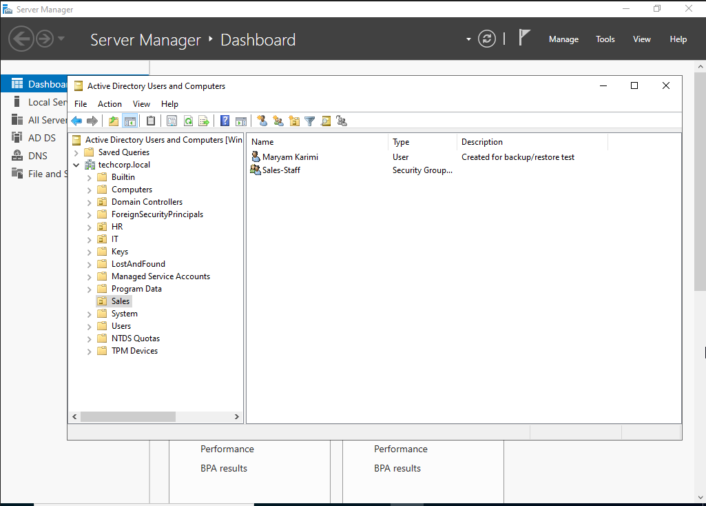
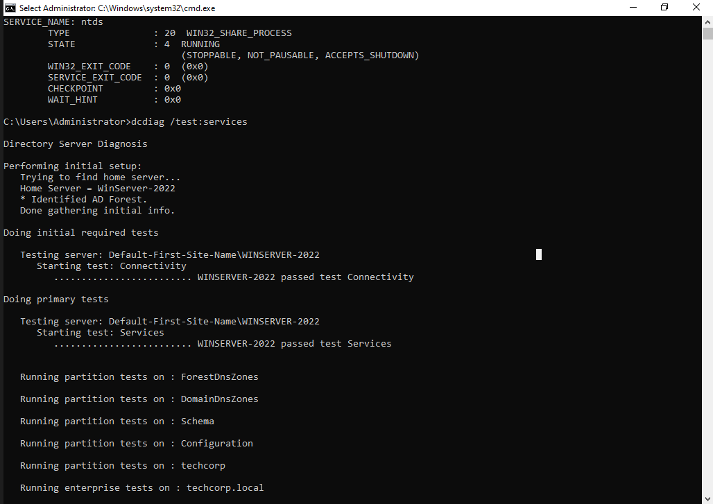

# TechCorp Active Directory Lab — Backup & Disaster Recovery

A self-hosted Active Directory environment (`techcorp.local`) built in
VirtualBox to practice enterprise Windows Server administration: System
State backup design, isolated backup storage, disaster simulation, and
System State recovery via Directory Services Restore Mode (DSRM).

## Environment

| Machine | Role | OS | IP |
|---|---|---|---|
| WinServer-2022 | Domain Controller (AD DS, DNS) | Windows Server 2022 | 192.168.10.1 |
| WinServer-2019 | File Server / isolated backup target | Windows Server 2019 | 192.168.10.2 |

Both machines run on a shared VirtualBox Internal Network (`techcorp-lab`,
192.168.10.0/24).

## What Was Built

### 1. Backup Design Decisions

Before touching any tooling, a few architectural decisions were made:

- The System State backup is **not** stored on a DFS-Replicated share.
  Backups should stay isolated and controlled, not replicated like live
  data — replication would unnecessarily expand the attack surface of the
  backup itself.
- Instead, a separate, non-replicated, admin-only share
  (`\\WinServer-2019\SystemStateBackups`) holds the backup, kept off the DC
  entirely, following the 3-2-1 backup principle (a copy off the source
  machine).
- Access to this share is restricted at **both** layers — Share
  Permissions and NTFS Permissions — to the local Administrators group
  only, not `Everyone`.

**Design note:** a DC's System State backup only covers the DC itself (AD
database, SYSVOL, registry, and CA database if present) — it has no
knowledge of and cannot restore other servers. Each domain member needs its
own independent backup strategy.

### 2. Taking the Backup

Windows Server Backup was installed on WinServer-2022 and a manual System
State backup was run via `Backup Once`, targeting the isolated remote
share.

### 3. Disaster Simulation

To test recovery at a realistic but low-risk scale, a test user
(`Maryam Karimi`) was created inside the mostly-unused `Sales` OU, which
also contains the `Sales-Staff` security group. The entire `Sales` OU
(user, group, and container together) was then deliberately deleted —
simulating an admin accidentally removing a whole department's AD
structure.

**Reasoning:** if a small-scale restore (one OU, one user, one group)
recovers correctly, the same System State recovery mechanism restores the
entire AD database — the recovery process doesn't operate object-by-object,
so this scale is sufficient to validate the whole mechanism.

### 4. Restore via DSRM

Recovery required booting WinServer-2022 into **Directory Services Restore
Mode (DSRM)**, since AD cannot restore itself while running. From DSRM,
the backup was located and restored from the remote share using:

wbadmin get versions -backuptarget:\\WinServer-2019\SystemStateBackups$ -machine:WinServer-2022.techcorp.local
wbadmin start systemstaterecovery -version:VersionID -backuptarget:\\WinServer-2019\SystemStateBackups$ -machine:WinServer-2022.techcorp.local

Since only one DC exists in this lab, the restore is **Non-Authoritative**
(the default) — no `ntdsutil` Authoritative Restore was needed. In a
multi-DC environment, an Authoritative Restore would be required so the
restored objects aren't immediately overwritten again by replication from
the other DCs.

### 5. Verification

After restoring and disabling DSRM Safe Boot, the domain came back online
normally and the deleted OU/user/group were confirmed present again. AD
health was verified with `dcdiag /test:services`.

## Troubleshooting Notes

The most time-consuming part of this scenario wasn't the backup or the
restore itself — it was diagnosing why the restore couldn't authenticate
to the remote share from DSRM. The investigation, in order:

- **`net use` and Windows Event Viewer (Event ID 4776/4624) on the target
  server both confirmed the credentials authenticated successfully
  (Status `0x0`)** — ruling out a wrong username/password as the cause,
  despite `wbadmin` repeatedly reporting a generic permission error.
- **Checked NTFS permissions on the backup folder and its
  `WindowsImageBackup` subfolder** — both correctly granted the local
  Administrators group Full Control. Not the cause.
- **Checked User Rights Assignment** (`Back up files and directories`,
  `Restore files and directories`) on the target server — both already
  included Administrators. Not the cause.
- **Investigated `LocalAccountTokenFilterPolicy`** (UAC remote token
  filtering, which silently strips admin privileges like
  `SeBackupPrivilege` from local accounts connecting over the network) as
  a likely cause and enabled it via registry. Did not resolve the issue.
- **Root cause:** the Share Permissions (a separate layer from NTFS
  permissions) on the backup share had only ever been granted to the
  Domain Administrator account — not the local Administrator account being
  used for the DSRM restore, since DSRM has no access to the domain.
  Adding the local Administrators group to the Share Permissions resolved
  it immediately.

**Lesson:** Share Permissions and NTFS Permissions are two independent
layers — a restrictive setting in either one is enough to block access on
its own, and both need to be checked when diagnosing remote access
failures, not just NTFS.

- Also hit an unrelated, separately confirmed Windows Server 2022 issue
  where the Windows Server Backup GUI snap-in didn't register in Server
  Manager Tools even after a clean feature install; resolved by also
  installing the Network Load Balancing (NLB) feature alongside it.

## Security Notes / Best Practices Considered

- **Snapshot vs. Image vs. System State backup are not interchangeable.**
  A hypervisor snapshot is crash-consistent, not application-aware, and
  restoring a DC from one risks an AD USN rollback and replication
  corruption. System State backup is VSS-based (application-consistent)
  and is the correct, safe method for backing up a DC.
- **Authoritative vs. Non-Authoritative restore is an environment-size
  decision, not a technical default.** With a single DC, a
  Non-Authoritative restore is sufficient. In a multi-DC environment,
  restored objects would be silently overwritten again by replication
  unless explicitly marked Authoritative via `ntdsutil`.
- **Backup isolation is itself a security control.** Keeping backups off
  the DC, non-replicated, and restricted to Administrators-only limits the
  blast radius if either the DC or the backup target is compromised.
- This is a snapshot of the current state of the lab and reflects the
  decisions and trade-offs made at this stage — not a finished or final
  configuration.