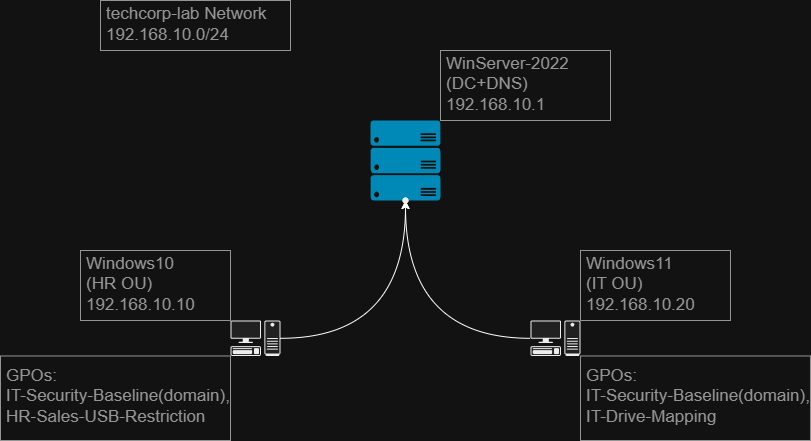
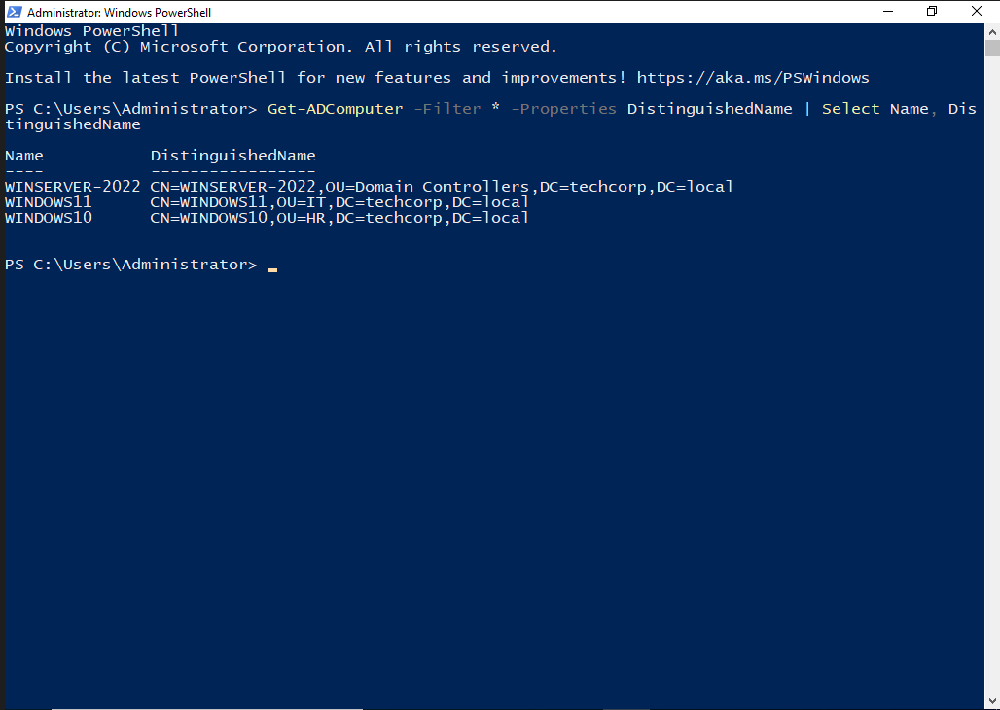
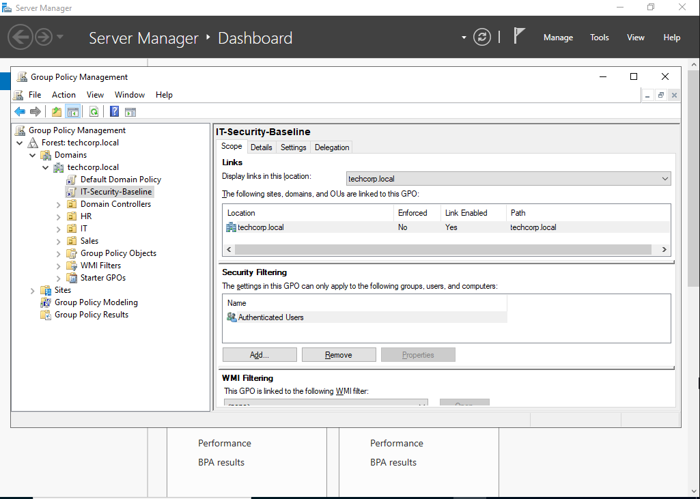
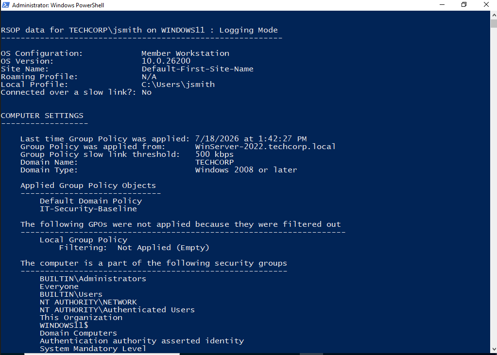
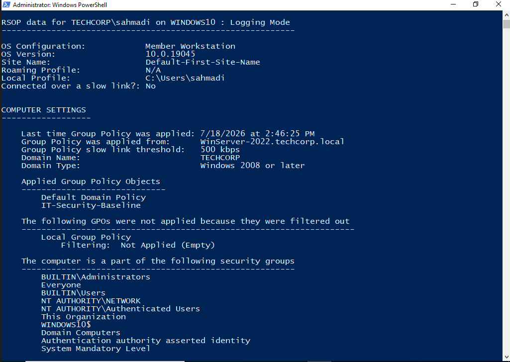
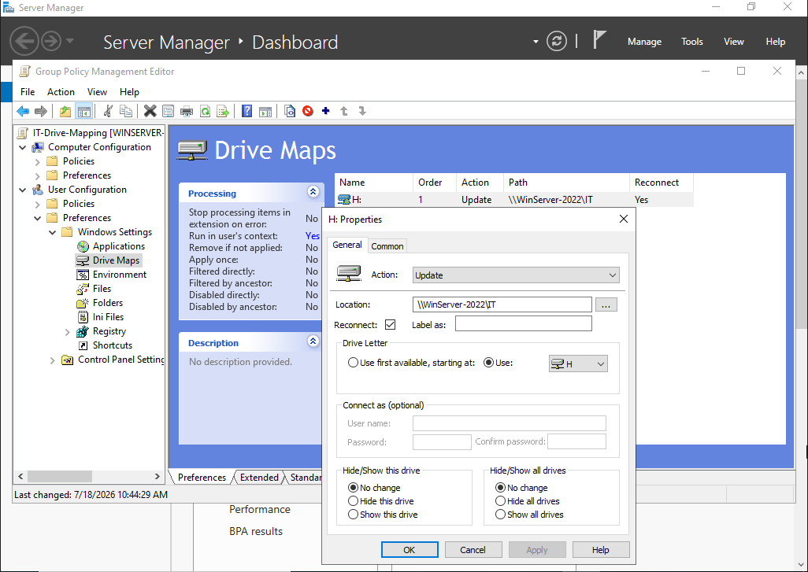
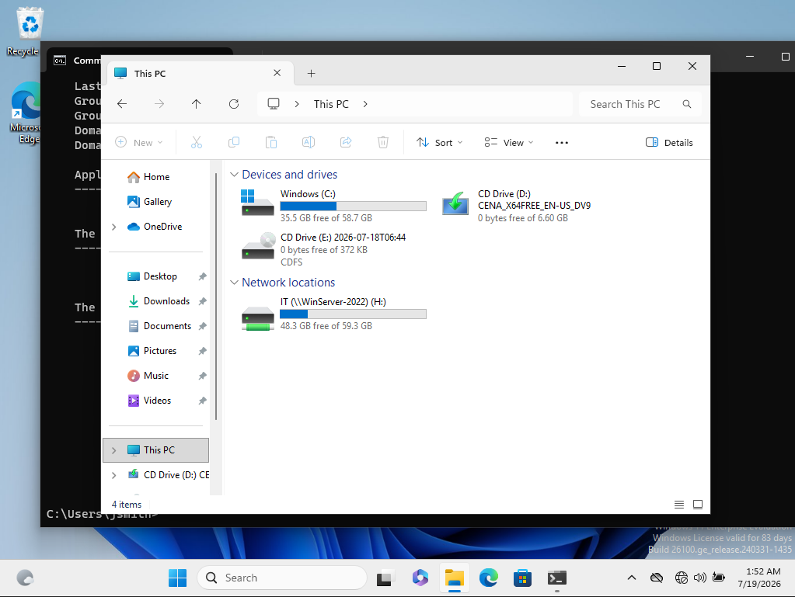
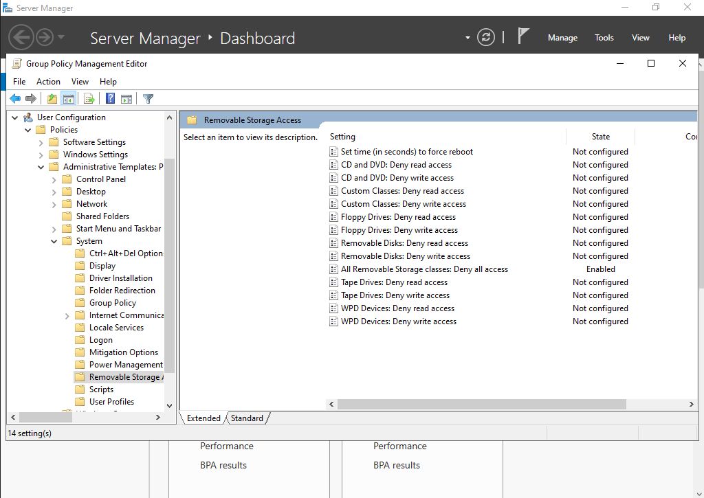
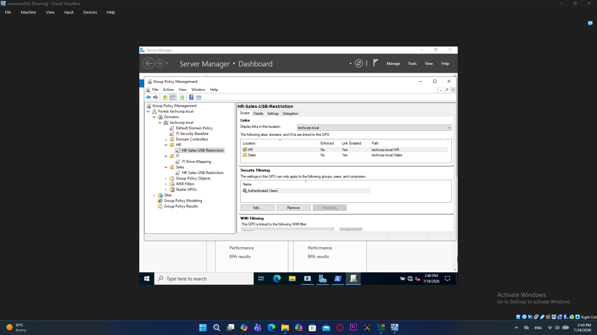
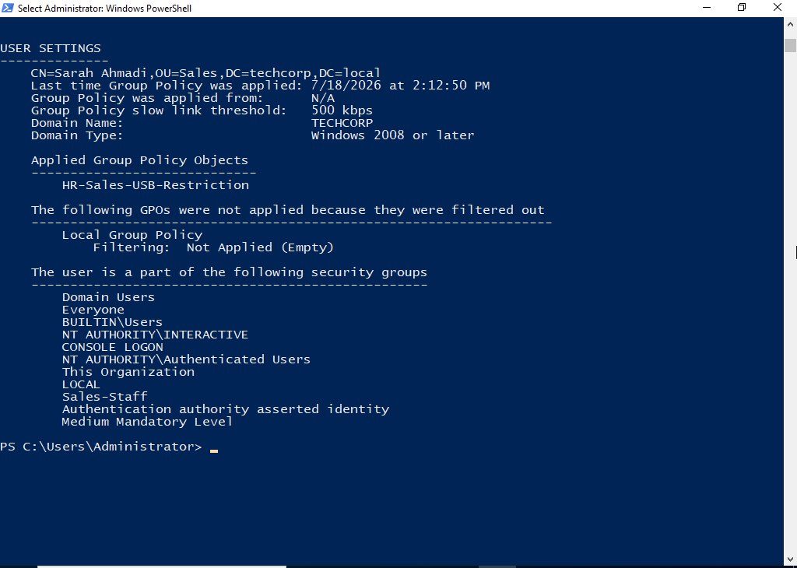

# TechCorp Active Directory Lab — Department Security & Access Policy

A self-hosted Active Directory environment (`techcorp.local`) built in 
VirtualBox to practice enterprise Windows Server administration: domain 
setup, department-based identity structure, file permissions, and Group 
Policy design for both device-wide security and department-specific access 
control.

## Environment

| Machine | Role | OS | IP |
|---|---|---|---|
| WinServer-2022 | Domain Controller (AD DS, DNS) | Windows Server 2022 | 192.168.10.1 |
| Windows11 | IT Department workstation | Windows 11 | 192.168.10.20 |
| Windows10 | HR Department workstation | Windows 10 22H2 | 192.168.10.10 |

All machines run on a shared VirtualBox Internal Network (`techcorp-lab`, 
192.168.10.0/24).

## What Was Built

### 1. Domain & Identity Structure
- Created the `techcorp.local` forest/domain on WinServer-2022 (AD DS + DNS)
- Designed 3 Organizational Units: `IT`, `Sales`, `HR`
- Created one user and one Global security group per department 
  (`jsmith`/`IT-Staff`, `sahmadi`/`Sales-Staff`, `mkarimi`/`HR-Staff`)
- Moved `WINDOWS11` and `WINDOWS10` computer objects out of the default 
  `Computers` container into their respective department OUs (`IT`, `HR`), 
  since GPOs linked to an OU only apply to objects actually located inside it

### 2. File Permissions (Least Privilege)
- Created department shares (`C:\Shares\IT`, `Sales`, `HR`)
- Applied NTFS permissions so each group can only access its own share 
  (Modify), verified with real Access Denied tests on the other 
  departments' shares
- Found and fixed an inherited permission bug where the built-in `Users` 
  group had been unintentionally granted access through inheritance
- Enabled Access-Based Enumeration (ABE) on all shares, so users only see 
  subfolders they have permission to access

**Note:** ABE hides subfolders a user can't access, but it does not hide the 
share name itself at the server's root share listing — this is expected 
Windows behavior, not a misconfiguration, and should not be mistaken for a 
security gap during an audit.

### 3. Domain-wide Security Baseline (Computer-based GPO)

GPO: `IT-Security-Baseline`
- Interactive logon inactivity limit: 300 seconds (auto screen lock)
- Sleep timeout with password-on-wake requirement

**Design decision:** initially scoped to the IT OU only, then deliberately 
re-linked to the domain root (`techcorp.local`). Screen-lock security is a 
device-level concern that should apply to every machine regardless of which 
department uses it — scoping it to one OU would have left other 
departments' machines unlocked and exposed.

Verified with `gpresult` on both workstations, confirming the policy applies 
under `COMPUTER SETTINGS` on IT and HR alike:

### 4. Department-Specific GPOs (User-based)

**`IT-Drive-Mapping`** (linked to OU: IT)
- Maps `H:` to `\\WinServer-2022\IT` via Group Policy Preferences
- Confirmed under the `jsmith` (IT) account in File Explorer

**`HR-Sales-USB-Restriction`** (linked to OU: HR, Sales)
- `All Removable Storage classes: Deny all access`, enabled
- Chosen over configuring individual classes (Removable Disks, CD/DVD, WPD 
  devices, etc.) one by one, because this single policy takes precedence 
  over all of them at once — it also covers portable devices like phones 
  connected via MTP/WPD, which are easy to overlook if only USB flash drives 
  are restricted
- Verified via `gpresult` on the HR test account

## Troubleshooting Notes

Real issues hit during this build, and how they were diagnosed:

- **`gpresult /r` returning no data under an elevated prompt:** running 
  Command Prompt as Administrator switches the execution identity to the 
  Domain Admin account, not the actual logged-on user — so RSoP data comes 
  back empty. Fixed by running from a non-elevated prompt, or by querying 
  remotely from the DC with `gpresult /s <computer> /USER <domain\user> /r`.
- **Remote RSoP query failing with RPC/network path errors:** querying a 
  client's GPO result remotely from the DC requires the `Windows Management 
  Instrumentation (WMI)`, `File and Printer Sharing`, and `Network 
  Discovery` firewall rule groups to be enabled on that client first — none 
  of these are on by default.
- **GPO showing as applied, but the inactivity lock not actually 
  triggering:** confirmed via registry 
  (`HKLM\SOFTWARE\Microsoft\Windows\CurrentVersion\Policies\System\InactivityTimeoutSecs`) 
  that the correct value had been written, but the lock only started 
  working after a full restart of the workstation — `gpupdate /force` alone 
  updated the policy but did not make this specific setting take effect on 
  the already-active session.

## Security Notes / Best Practices Considered

- **Computer vs. User Configuration is a real architectural decision, not 
  just organization.** Some settings (inactivity lock, sleep timeout) only 
  exist under Computer Configuration and cannot be moved to User 
  Configuration — a security baseline like this should be scoped by device 
  need, not assumed to follow department boundaries.
- **USB restriction via GPO is not a complete defense against malware 
  introduced through removable media.** Denying read/write access to 
  Mass Storage-class devices does not protect against USB devices that 
  misrepresent themselves as a different device class (e.g., a HID 
  keyboard) at the firmware level — that class of attack requires physical 
  port controls or endpoint protection, not just this policy.
- **Access-Based Enumeration is a usability/least-disclosure control, not 
  an access control.** It hides what a user can browse to, but the 
  underlying NTFS permissions are what actually enforce access — ABE alone 
  should never be relied on as the security boundary.
- This is a snapshot of the current state of the lab and reflects the 
  decisions and trade-offs made at this stage — not a finished or 
  final configuration.