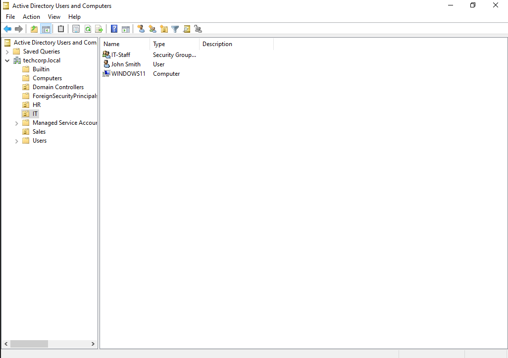
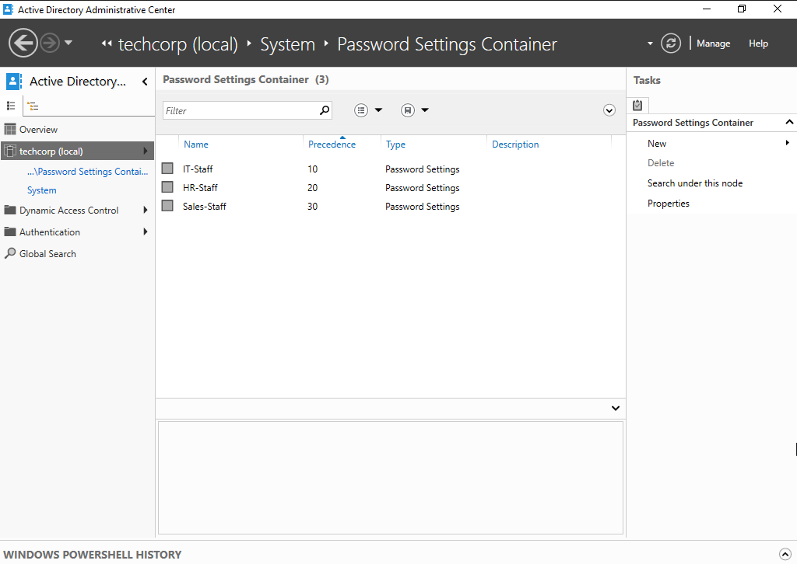
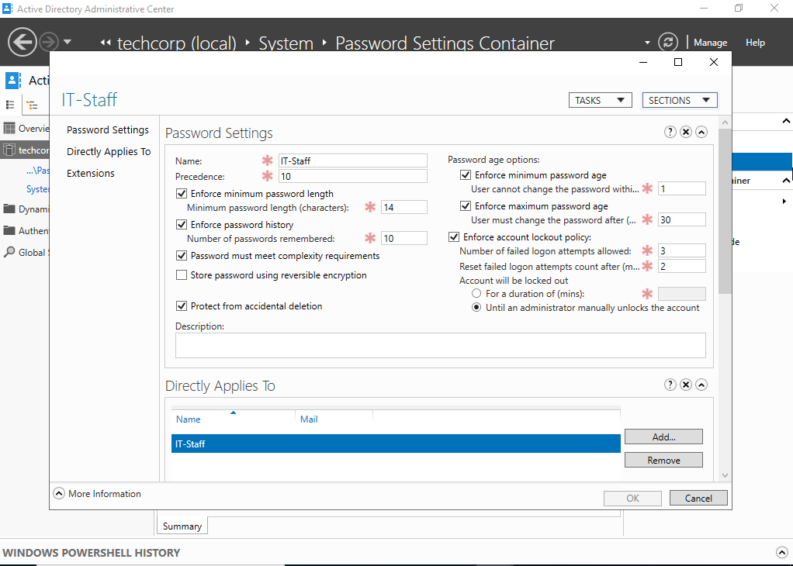
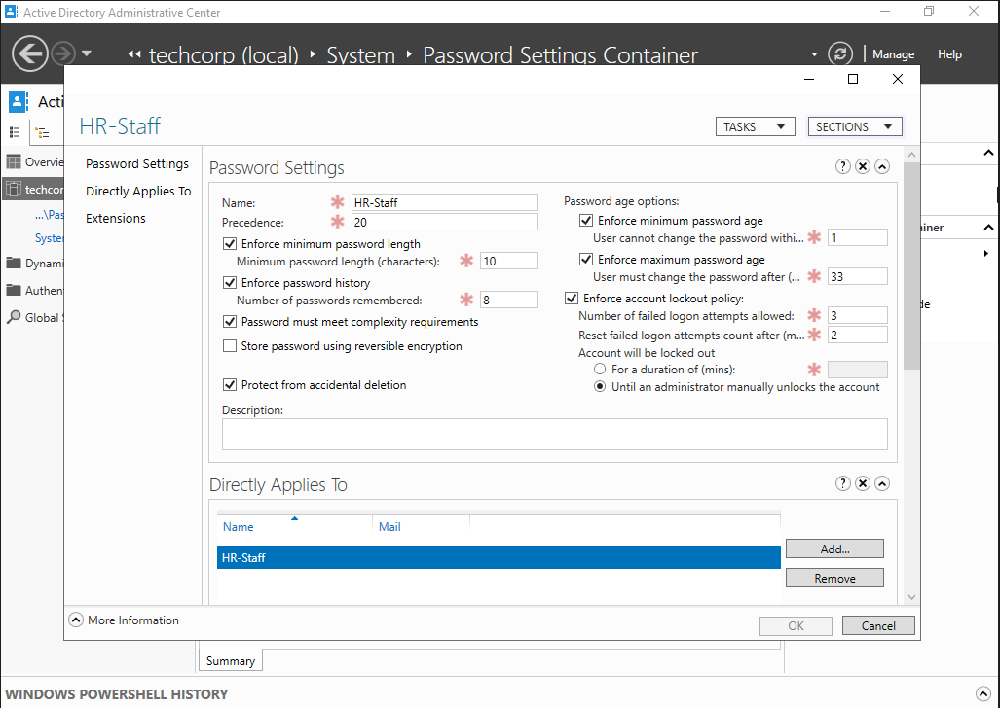
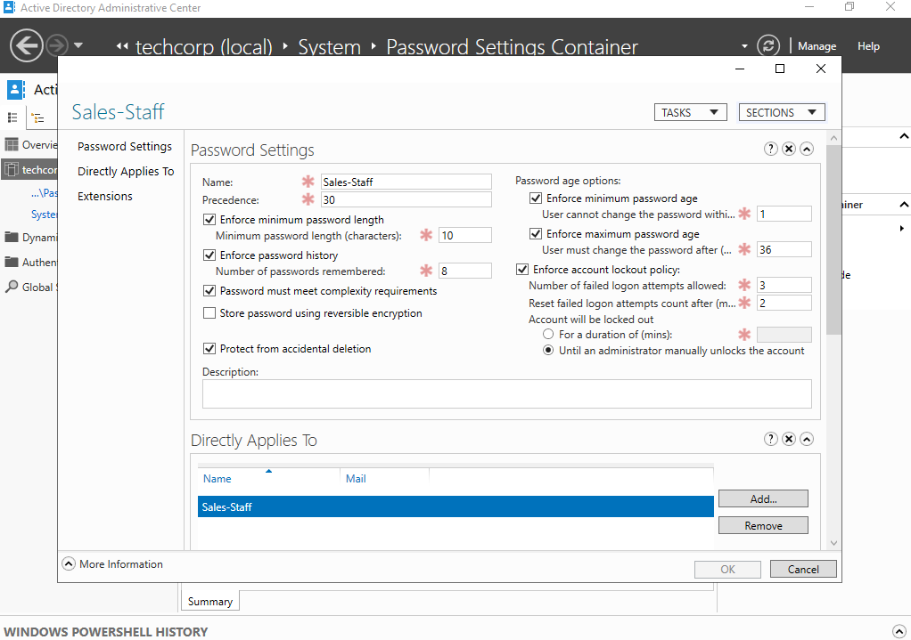
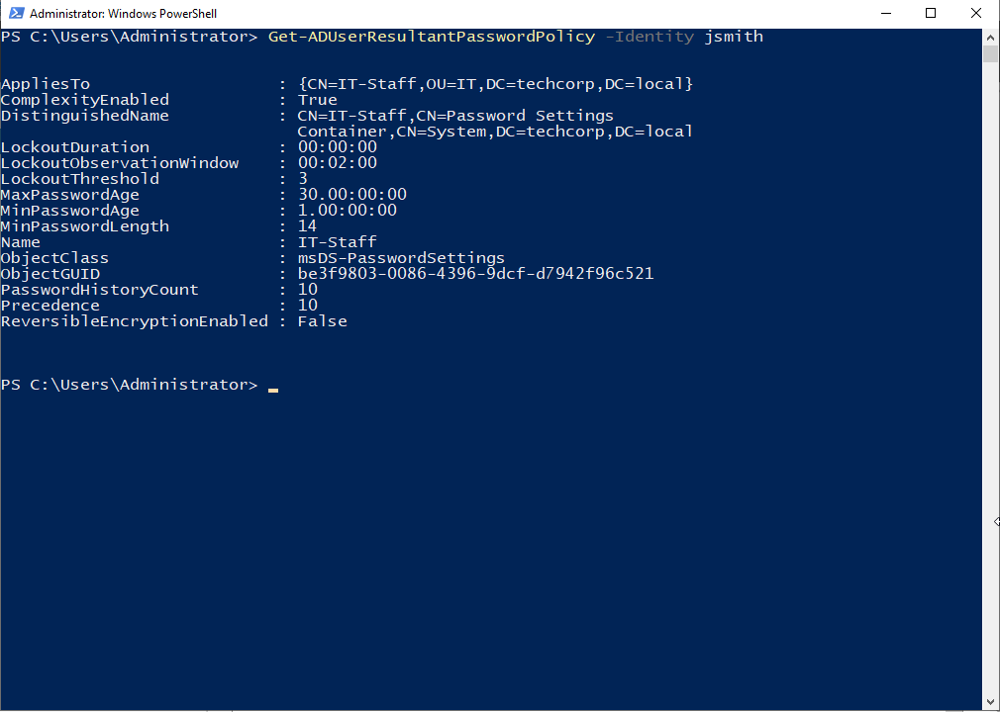
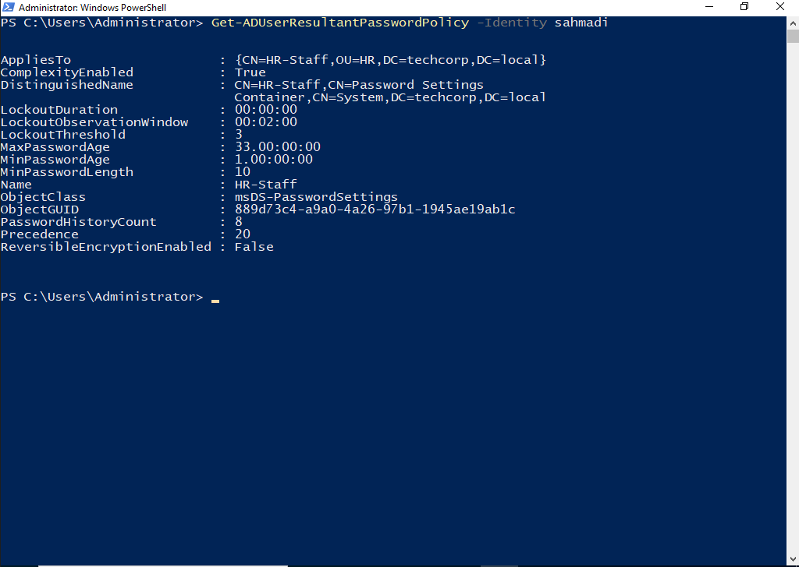
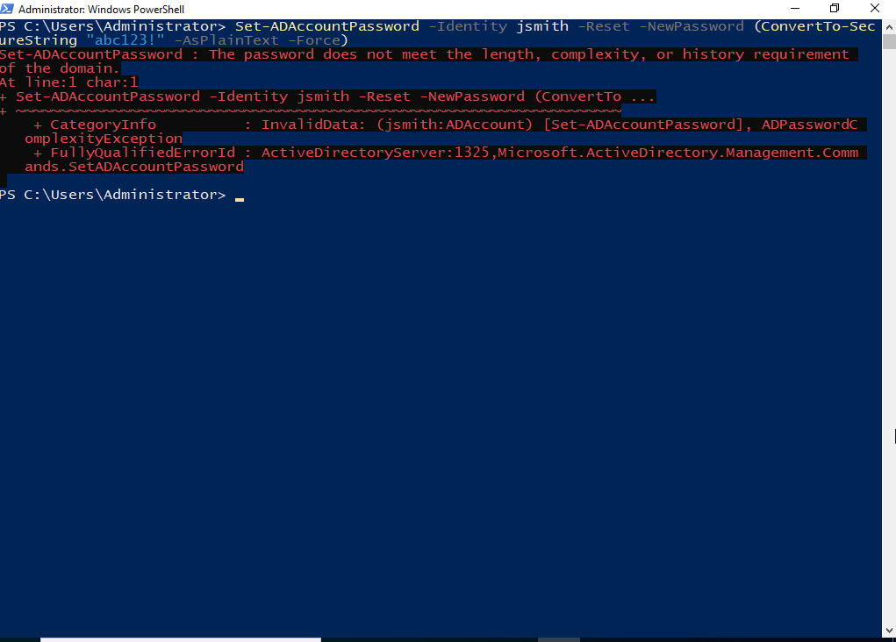

# TechCorp Active Directory Lab — Fine-Grained Password Policies & Security Group Filtering

A continuation of the `techcorp.local` Active Directory lab environment.
This phase replaces the single flat Default Domain Password Policy with
three separate Fine-Grained Password Policies (PSOs), each targeted at a
specific department's security group, so that IT, HR, and Sales can each
have password requirements matched to their risk level — without needing
a separate domain or GPO per OU.

## Starting Environment (Pre-Existing)

Before this phase, the domain already had the following structure in place
from earlier lab builds:

| Machine | Role | OS | IP |
|---|---|---|---|
| WinServer-2022 | Domain Controller (AD DS, DNS) | Windows Server 2022 | 192.168.10.1 |
| WinServer-2019 | Second Domain Controller (AD DS, DNS) | Windows Server 2019 | 192.168.10.2 |
| Windows11 | IT Department workstation | Windows 11 | 192.168.10.20 |
| Windows10 | HR Department workstation | Windows 10 22H2 | 192.168.10.10 |

- 3 Organizational Units: `IT`, `Sales`, `HR`
- Existing users: `jsmith` (IT), `sahmadi` (HR), and Maryam Karimi in Sales
- All 5 FSMO roles were re-consolidated back onto WinServer-2022 before
  starting this scenario, after WinServer-2019's evaluation license expired

## What Was Built

### 1. IT-Staff PSO
- Security group `IT-Staff` used as the target (not the `IT` OU) — PSOs
  can only be linked to users or global security groups, never to OUs
  directly
- Precedence: 10 (lowest number = highest priority)
- Min password length: 14 | Password history: 10 | Min age: 1 day |
  Max age: 30 days | Lockout threshold: 3 attempts (admin unlock only)
- Reflects IT having the highest access level in the domain, hence the
  strictest requirements

### 2. HR-Staff PSO
- Linked to the existing `HR-Staff` security group
- Precedence: 20
- Min password length: 10 | Password history: 8 | Min age: 1 day |
  Max age: 33 days | Lockout threshold: 3 attempts (admin unlock only)

### 3. Sales-Staff PSO
- The `Sales-Staff` security group did not exist yet and was created from
  scratch inside the `Sales` OU
- Existing user Maryam Karimi was moved into the `Sales` OU and added as
  a member of `Sales-Staff`
- Precedence: 30
- Min password length: 10 | Password history: 8 | Min age: 1 day |
  Max age: 36 days | Lockout threshold: 3 attempts (admin unlock only)
- Caught and corrected a copy-paste mistake during setup where the PSO
  name and Precedence value initially duplicated the HR-Staff PSO

## Verification

### Resultant Policy Check
Ran `Get-ADUserResultantPasswordPolicy` against one user from each
department to confirm the correct PSO — not the Default Domain Policy —
was actually resolving for them:

- `jsmith` → Precedence 10, MinLength 14, MaxAge 30 ✅
- `sahmadi` → Precedence 20, MinLength 10, MaxAge 33 ✅
- `mkarimi` → Precedence 30, MinLength 10, MaxAge 36 ✅

### Live Enforcement Test
A resultant-policy match only proves the object resolves correctly — it
doesn't prove the policy is actually enforced at password-change time.
To confirm real enforcement, attempted to reset `jsmith`'s password to a
weak value below the PSO's 14-character minimum:

    Set-ADAccountPassword -Identity jsmith -Reset -NewPassword (ConvertTo-SecureString "abc123!" -AsPlainText -Force)

This was correctly rejected with `The password does not meet the length,
complexity, or history requirement of the domain.` Running this against
`jsmith` specifically (a real member of the `IT-Staff` group, not just a
user sitting in the `IT` OU) rules out the possibility that the rejection
was coming from the Default Domain Policy instead of the PSO.

## Best Practices & Security Notes

- **Link PSOs to groups, not OUs.** Fine-Grained Password Policies apply
  only to users and global security groups. Linking to a group (rather
  than adding users individually) makes the policy scale automatically as
  people join or leave the department.
- **Precedence, not OU hierarchy, decides conflicts.** If a user somehow
  ends up in more than one PSO-linked group, the PSO with the lowest
  Precedence number wins — regardless of which OU the user physically
  sits in. This is a common source of confusion for people used to GPO
  inheritance rules.
- **Password history depth is a lightweight control.** A higher history
  count blocks password reuse without adding meaningful load to the
  server — it only stores password hashes, not full password change
  logs, so setting it aggressively high (e.g. 24) has little downside for
  higher-security groups like IT.
- **Min password age is often overlooked but matters.** Without a minimum
  age, a user forced to change their password can immediately change it
  back to the old one 10 times in a row to cycle past history
  requirements. A 1-day minimum age (as used here for all three PSOs)
  closes that loophole cheaply.
- **Max age doesn't need to land on a "clean" number.** Values like 33 or
  36 days work exactly the same as 30 or 90 — there's no security or
  technical reason to round to a "neat" number, and syncing every
  department's expiry to the same day of the month can actually create a
  worse problem: a spike of simultaneous password resets/lockout calls
  across the whole company on one day, instead of the load being spread
  out.
- **Test at the group-membership level, not just the OU.** A password
  policy test against a user who merely lives in the right OU but isn't a
  group member can produce a false pass or false fail. Always confirm
  group membership first, then test enforcement.

## Key Takeaways

- A PSO resolving correctly via `Get-ADUserResultantPasswordPolicy` and a
  PSO actually being enforced at password-change time are two different
  things — both need to be verified independently.
- Group-based targeting (Security Group Filtering) instead of OU-based
  targeting is what makes Fine-Grained Password Policies flexible enough
  to reflect a real department risk hierarchy without duplicating OU
  structures.
- Small setup mistakes (duplicate Precedence values, mismatched names)
  are easy to make when building multiple similar PSOs back-to-back —
  worth double-checking each one against the others before moving to
  verification.
- This is a snapshot of the current state of the lab and reflects the
  decisions and trade-offs made at this stage — not a finished or final
  configuration.
