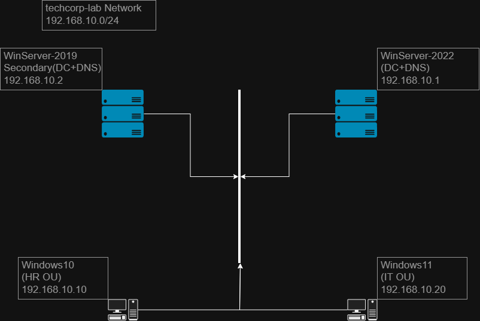

# TechCorp Active Directory Lab — Second Domain Controller & Failover Resilience

A continuation of the `techcorp.local` Active Directory lab environment. 
This phase adds a second Domain Controller to the existing domain to 
eliminate the single point of failure created by having only one DC, 
transfers FSMO roles to it, and validates — through real failure 
simulation, not just documentation — that clients can still authenticate 
when the original DC goes offline.

## Starting Environment (Pre-Existing)

Before this phase, the domain already had the following structure in place 
from an earlier lab build (Department Security & Access Policy):

| Machine | Role | OS | IP |
|---|---|---|---|
| WinServer-2022 | Domain Controller (AD DS, DNS) — sole DC | Windows Server 2022 | 192.168.10.1 |
| Windows11 | IT Department workstation | Windows 11 | 192.168.10.20 |
| Windows10 | HR Department workstation | Windows 10 22H2 | 192.168.10.10 |

- 3 Organizational Units: `IT`, `Sales`, `HR`
- One user + one Global security group per department (`jsmith`/`IT-Staff`, 
  `sahmadi`/`Sales-Staff`, `mkarimi`/`HR-Staff`)
- Both client workstations had DNS pointed exclusively at WinServer-2022 
  (single point of failure carried over into this phase — see Failover 
  Test below)

All machines run on a shared VirtualBox Internal Network (`techcorp-lab`, 
192.168.10.0/24).

## What Was Added in This Phase

| Machine | Role | OS | IP |
|---|---|---|---|
| WinServer-2019 | Second Domain Controller (AD DS, DNS) | Windows Server 2019 | 192.168.10.2 |

## What Was Built

### 1. Promoting the Second Domain Controller
- Deployed a Windows Server 2019 VM on the `techcorp-lab` network, 
  configured with a static IP and DNS pointed at the existing DC
- Joined the domain and renamed the server to `WinServer-2019`
- Installed the AD Domain Services role
- Hit a promotion failure caused by a stale/inconsistent local AD database 
  (`ntds.dit`) left over from an earlier failed attempt — resolved by 
  uninstalling the AD DS role, removing `C:\Windows\NTDS`, and reinstalling 
  cleanly
- Successfully promoted WinServer-2019 to Domain Controller

### 2. Verifying Replication
- Confirmed both DCs replicate successfully across all partitions (Domain, 
  Configuration, Schema, DomainDnsZones, ForestDnsZones) using 
  `repadmin /replsummary`

### 3. Transferring FSMO Roles
- All 5 FSMO roles (Schema Master, Domain Naming Master, PDC Emulator, RID 
  Master, Infrastructure Master) resided on WinServer-2022 by default, as 
  expected for the domain's original DC
- Transferred all 5 roles to WinServer-2019 using 
  `Move-ADDirectoryServerOperationMasterRole` (PowerShell) and the GUI 
  equivalents (Active Directory Users and Computers, Domains and Trusts)

**Note on Schema Master:** unlike the other four roles, transferring the 
Schema Master requires a separate MMC snap-in that isn't registered by 
default (`regsvr32 schmmgmt.dll`), and the snap-in must be explicitly 
pointed at the target DC via "Change Active Directory Domain Controller" 
before the transfer option becomes available.

## Failover Test

The goal: confirm that both client workstations (Windows10, Windows11) 
could still authenticate against the domain if WinServer-2022 — the 
original DC — went offline, with all FSMO roles now on WinServer-2019.

### Attempt 1: Misleading Success
Shutting down WinServer-2022 and logging into the clients appeared to 
succeed. This was **not** proof of failover — it was Windows' **Cached 
Domain Credentials**, which allow a login using a locally stored password 
hash when no DC is reachable at all. No real authentication against 
WinServer-2019 was happening.

### Root Cause #1: Single Point of Failure in Client DNS
Both clients had only WinServer-2022 configured as their DNS server 
(carried over from the original single-DC setup). With it offline, DNS 
resolution for the domain failed entirely — confirmed with 
`Resolve-DnsName` (the built-in `nslookup` tool does not reliably fail 
over between DNS servers the way the actual Windows DNS Client service 
does).

**Fix:** Added WinServer-2019 as an alternate DNS server on both clients.

### Root Cause #2: Netlogon Discovery Cache
Even after fixing DNS, `Test-ComputerSecureChannel` still returned `False`. 
This was caused by the Netlogon service caching the previously discovered 
DC (WinServer-2022) and not automatically re-discovering WinServer-2019.

**Fix:** `Restart-Service Netlogon -Force` (run as Administrator) on each 
client, forcing re-discovery.

### Final Verification
With WinServer-2022 powered off, on both clients:
- `Resolve-DnsName techcorp.local` returned both DC IP addresses
- `Test-ComputerSecureChannel -Verbose` returned `True`, confirming a real, 
  live secure channel to WinServer-2019 — not a cached credential

## Troubleshooting Notes

Real issues hit during this build, and how they were diagnosed:

- **`Test-ComputerSecureChannel` succeeding on the client but 
  `Move-ADDirectoryServerOperationMasterRole` failing between the two DCs 
  with "The directory service is unavailable":** basic connectivity checks 
  (RPC port 135, firewall rules, time sync, Netlogon) all passed, but the 
  role transfer still failed — because it depends on a live RPC/DRSUAPI 
  negotiation over dynamic ports, not just the static endpoint mapper port. 
  Confirmed and resolved by verifying the full `Active Directory Domain 
  Controller` firewall rule group was enabled on both DCs (not just the 
  general RPC rules).
- **A prior series of unexplained, error-free shutdowns on WinServer-2019** 
  turned out to be caused by an expiring Windows Server Evaluation license, 
  not a configuration or hardware issue — identified via Event Viewer 
  (Event ID 1074, source `wlms.exe`), which explicitly logged the license 
  expiration as the shutdown reason.
- **`repadmin /replsummary` showing stale replication failures** after 
  resolving a DC outage — the summary only refreshes per replication 
  direction as each DC pushes its own changes; running 
  `repadmin /syncall /AdeP` from **both** DCs (not just one) was required 
  to clear the stale entries from both directions.

## Key Takeaways

- Adding a second Domain Controller does not, by itself, provide 
  redundancy — client-side DNS configuration must also be redundant, or 
  the failover is meaningless in practice.
- A successful login is not proof of live authentication — cached 
  credentials can fully mask a broken failover path.
- Standard tools like `nslookup` don't always reflect how Windows itself 
  behaves; `Resolve-DnsName` and `Test-ComputerSecureChannel` gave a more 
  accurate picture of real DC reachability.
- Service-level caching (Netlogon) can persist stale DC information even 
  after the underlying network issue is fixed, requiring an explicit 
  service restart to force re-discovery.
- This is a snapshot of the current state of the lab and reflects the 
  decisions and trade-offs made at this stage — not a finished or final 
  configuration.